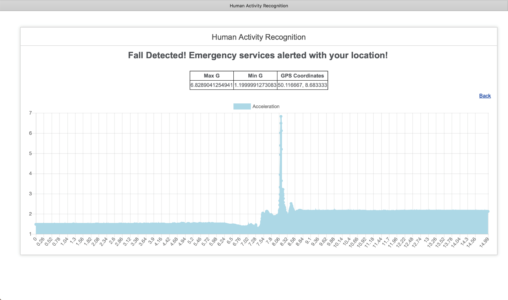

# Human Activity Recognition

HIS-Master-Projekt, Winter 2018  

## Introduction

This is a web application created to simulate a heatlh detection and warning system for Human Fall.  

## Prerequisites  

1. Browser capable of running PHP scripts  
2. Data file (CSV)

## Environment Details  

This application uses Codeignitor framework and uses following tech stack: PHP, Javascript, HTML

## Dataset
- The data required is sourced from a user wearing a belt consisting of versatile sensors unit including two Accelerometers, a Gyroscope and a GPS.
- The accelerometers and gyroscope will collect the walking data and angular measurement respectively and in addition to that we have added GPS sensor which provide the exact location of the patient.
- Data format in CSV (Raw data) of 1st accelerometer (G1) and 2nd accelerometer (G2) is as follows.

Sr No | Gx1 | Gy1 | Gz1 | Gx2 | Gy2 | Gz2
--- | --- | --- | --- | --- | --- | ---
1 | 6 | -261 | -69 | 1 | -255 | -75
2 | 8 | -268 | -66 | 6 | -251 | -52
3 | 9 | -273 | -60 | 2 | -246 | -79

## Mathematical Model

Formula :
Acceleration [g]: (2 ∗ Range)/(2^Resolution ) ∗ AD

where, AD stands for acceleration data in all 3 axes (x, y, z) 

Acceleration Sensor 1 = Range: ±16G , Resolution: 13 bits  
Acceleration Sensor 2 = Range: ±8G , Resolution: 14 bits  

We will get new values as Gx,Gy,Gz parameters. For calculating the overall acceleration, we have used below formula:

Overall acceleration Gmax = √(G²x + G²y + G²z)  

We have termed highest value as Gmax and lowest value as Gmin. 
If Gmax − Gmin > 2.5G, Gmax should occur after Gmin then it is a critical fall.

## Folder Structure (Overview)
    |-----application/  ~ Scripts for calculating the performance of various object detection models 
            |---- config/  ~ App configuration files 
            |---- controllers/  ~ Controller files 
                |---- Patient.php/  ~ Script containing all business logic 
            |---- libraries/  ~ Supporting library files (JS Chart library) 
            |---- models/  ~ Database connection files 
            |---- views/  ~ View/User interface files written in PHP, HTML, JavaScript 
                |---- patient.php/  ~ UI containing patient detection dashboard 
    |-----system/  ~ Codeignitor framework system files 

## Usage

1. Import fall data using "Import" button.
2. System detects a fall using the inbuilt algorithm and outputs a "Fall" or "No fall" result with Max G and Min G
3. In case of a fall the system shows a scenario where the emergency services are informed with the GPS location (Dummy location in Frankfurt city = 50.116667, 8.683333).
3. The system also outputs a readable graph showing the acceleration data from the sensor with respect to time.

## User Interface  

- Web UI : Provides an overall view in the form of a dashboard representing fall information
        
        
        